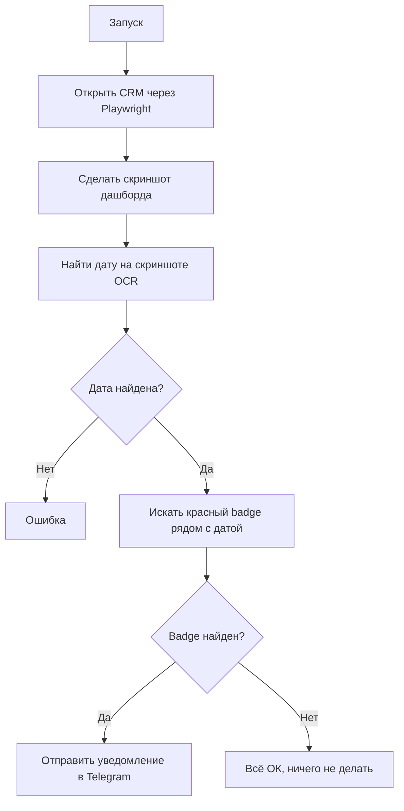

# 🔍 CRM Order Monitor - Система мониторинга неразобранных заказов

## 📋 Описание

Автоматическая система мониторинга CRM для отслеживания **неразобранных заказов** в двух городах (Варшава, Берлин). Система делает скриншоты дашборда CRM, анализирует их с помощью компьютерного зрения и отправляет уведомления в Telegram при обнаружении проблем.

## 🎯 Что мониторит

Система ищет **красный badge с цифрой** в правом верхнем углу карточки даты на дашборде CRM. Этот badge показывает количество **неразобранных заказов** для конкретной даты.

### Пример:
```
┌─────────────────────────────┐
│ 22.11          ┌───┐        │
│                │ 2 │ ← BADGE│
│ Кол-во: 126    └───┘        │
│ Подтверждено: 126           │
└─────────────────────────────┘
```

## 🏗️ Архитектура

### Компоненты:

1. **`multi_crm_monitor.py`** - главный скрипт мониторинга
   - Запускает браузер через Playwright
   - Делает скриншоты дашборда для каждого города
   - Вызывает алгоритм детекции
   - Отправляет уведомления в Telegram

2. **`badge_presence.py`** - алгоритм детекции
   - OCR для поиска дат на скриншоте (EasyOCR)
   - Computer Vision для поиска красного badge (OpenCV)
   - Возвращает результат: найден badge или нет

3. **`multi_crm_config.py`** - конфигурация
   - Список CRM инстансов (города)
   - URL, credentials, временные зоны
   - Параметры уведомлений

4. **GitHub Actions** (`.github/workflows/crm-monitor.yml`)
   - Автоматический запуск каждые 15 минут
   - Время работы: 8:00-22:00 (UTC)
   - Кеширование EasyOCR моделей

5. **Local (launchd)** - локальный запуск на Mac
   - `com.cleanwhale.multi-crm-watcher.plist`
   - Запуск каждые 15 минут

## 🔧 Технологии

- **Python 3.9+**
- **Playwright** - автоматизация браузера
- **EasyOCR** - распознавание текста (даты)
- **OpenCV** - компьютерное зрение (поиск красного badge)
- **Telegram Bot API** - уведомления
- **GitHub Actions** - CI/CD и автоматический запуск

## 📦 Установка

### 1. Клонировать репозиторий:
```bash
git clone https://github.com/ivanshyla/OrdersToTelegram.git
cd OrdersToTelegram/crm-watcher
```

### 2. Установить зависимости:
```bash
pip install -r requirements.txt
playwright install chromium
```

### 3. Создать `.env` файл:
```bash
cp env.example .env
```

Заполнить:
```env
TELEGRAM_BOT_TOKEN=your_bot_token
TELEGRAM_CHAT_ID=your_chat_id
CRM_LOGIN_WARSAW=email@example.com
CRM_PASSWORD_WARSAW=password
CRM_LOGIN_BERLIN=email@example.com
CRM_PASSWORD_BERLIN=password
```

## 🚀 Запуск

### Локально (разовый):
```bash
cd crm-watcher
python3 multi_crm_monitor.py
```

### Локально (автоматический через launchd):
```bash
cd crm-watcher
./setup_service.sh
# Сервис будет запускаться каждые 15 минут
```

### GitHub Actions:
Push в `main` → автоматически запускается workflow.

## 📊 Логика работы



## 🎨 Алгоритм детекции красного badge

1. **Найти дату** через EasyOCR (например "22.11")
2. **Определить область поиска**:
   - Правый верхний угол карточки
   - Ширина карточки ~250px
   - Badge на расстоянии 170-250px вправо от даты
3. **HSV фильтр** для красного цвета:
   ```python
   H: [0-10] or [170-180]
   S: [150-255]
   V: [150-255]
   ```
4. **Фильтрация контуров**:
   - Площадь: 300-3000 пикселей
   - Aspect ratio: 0.7-1.5 (примерно квадратный)
5. **Результат**: `True` если badge найден

## 📁 Структура проекта

```
OrdersToTelegram/
├── crm-watcher/
│   ├── multi_crm_monitor.py      # Главный скрипт
│   ├── badge_presence.py          # Алгоритм детекции
│   ├── multi_crm_config.py        # Конфигурация
│   ├── requirements.txt           # Python зависимости
│   ├── .env                       # Секреты (не в git)
│   ├── run_artifacts/             # Скриншоты и логи
│   └── com.cleanwhale.multi-crm-watcher.plist  # launchd
├── .github/workflows/
│   └── crm-monitor.yml            # GitHub Actions workflow
├── FINAL_FIX.md                   # История исправлений
└── README.md                      # Эта документация
```

## ⚙️ Конфигурация

### Время работы:
- **GitHub Actions**: каждые 15 минут, 8:00-22:00 UTC
- **Local (launchd)**: каждые 15 минут

### Часы отправки уведомлений:
```python
"notification_hours": [8,9,10,11,12,13,14,15,16,17,18,19,20,21,22]
```
Уведомления отправляются только в эти часы (по timezone города).

### Cooldown между уведомлениями:
```python
"alert_cooldown_minutes": 60
```
Повторные уведомления для той же даты не чаще 1 раза в час.

## 🐛 Отладка

### Проверить что система работает:
```bash
cd crm-watcher
python3 multi_crm_monitor.py
```

### Посмотреть последний скриншот:
```bash
ls -lt run_artifacts/dash_*.png | head -1
```

### Тестировать алгоритм детекции на скриншоте:
```bash
python3 badge_presence.py --image run_artifacts/dash_warsaw_latest.png --target tomorrow
```

### Логи GitHub Actions:
```bash
gh run list --workflow=crm-monitor.yml --limit 5
gh run view <run_id> --log
```

### Логи launchd:
```bash
tail -f crm-watcher/launchd_multi.log
tail -f crm-watcher/launchd_multi.err
```

## ✅ История исправлений

См. [`FINAL_FIX.md`](FINAL_FIX.md) для подробной истории исправления false positives.

### Ключевые этапы:
1. ❌ Детекция красного badge (первая версия) - много false positives
2. ❌ Детекция желтого предупреждения - показывало проблемы для всех дат
3. ❌ Сравнение чисел "Кол-во" vs "Подтвержденные" - не то же что "разобранные"
4. ✅ **Детекция красного badge в правом верхнем углу карточки** - РАБОТАЕТ!

## 📞 Контакты

- **Telegram Bot**: отправляет уведомления
- **GitHub**: [ivanshyla/OrdersToTelegram](https://github.com/ivanshyla/OrdersToTelegram)

## 📄 Лицензия

Private repository
